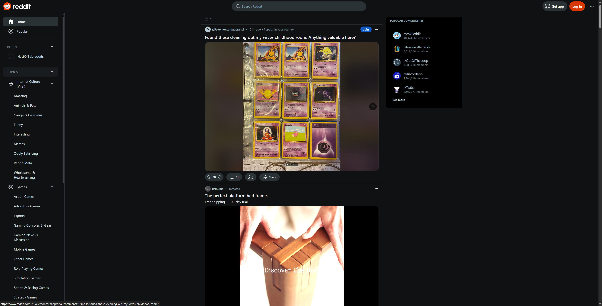
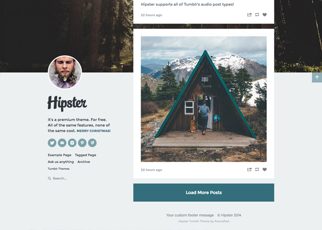
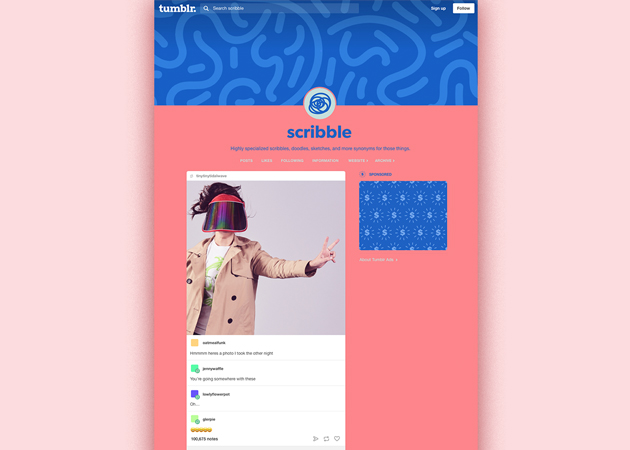
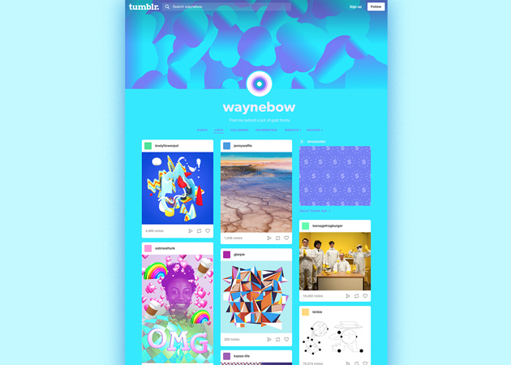
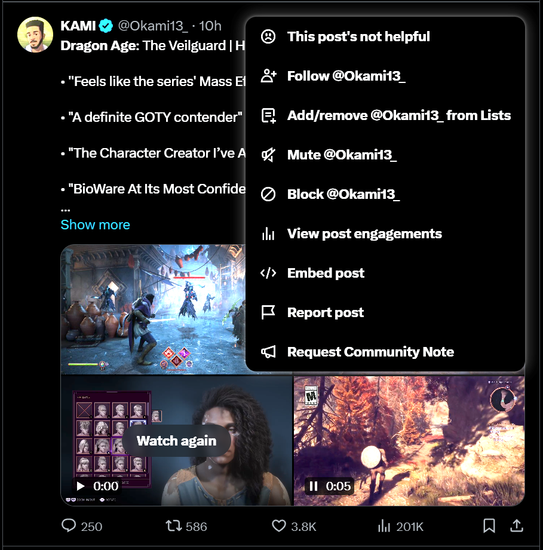

# Scrapbook

Reddit Home Page

 {width = 160 height = 90}
 
I want something that is smooth and approachable like this. However, I think Reddit makes it tough to get involved in communities by shoving popular and common communities on the side. It would be better to make "community discovery" more of a focus on Honk!! and put more effort into it. 

___

Instagram Reels

I want my homepage to have scrollability similar to Instagram reels. This format should drive individual engagement and would be interesting to implement in a forum format where the individual posts can become quite long. I also need to find a way to make this seemless evben though there will presumably be a lot of text, making this style of minimalism impossible.

___

Tumblr Blog Customization

 |  | 

This is the level of customization I'd like for the profiles on my platform. However, to edit Tumblr blogs like this, you need to have an adept understanding of HTML and I do not want to require my users to understand anything other than my UI in order to customize their profiles.

___

Discord Server Profiles

I want users to be able to do a more elaborate version of this, where they can change the way their profile shows up when viewed from different subforums. This will allow more personalization when interacting with certain communities and can help in peoples' sense of belonging.

___

Twitter Post

This is a similar UI to what I want. I want a minimalist menu that can be pulled up to interact with the post when you need to do something more formal (submit a report, etc.), but I want numbers about the post, such as viewers, likes, shares, etc to be easily viewable. I will probably move these to the side to allow for more seamless reading of the forum instead of making numbers the prevalent feature, but it is important to me that they are still there.

___

# Storyboarding  (IN MS PAINT, for your viewing pleasure)

User makes a post.

User changes their display name.

User blocks trump for disliking cranberries.

