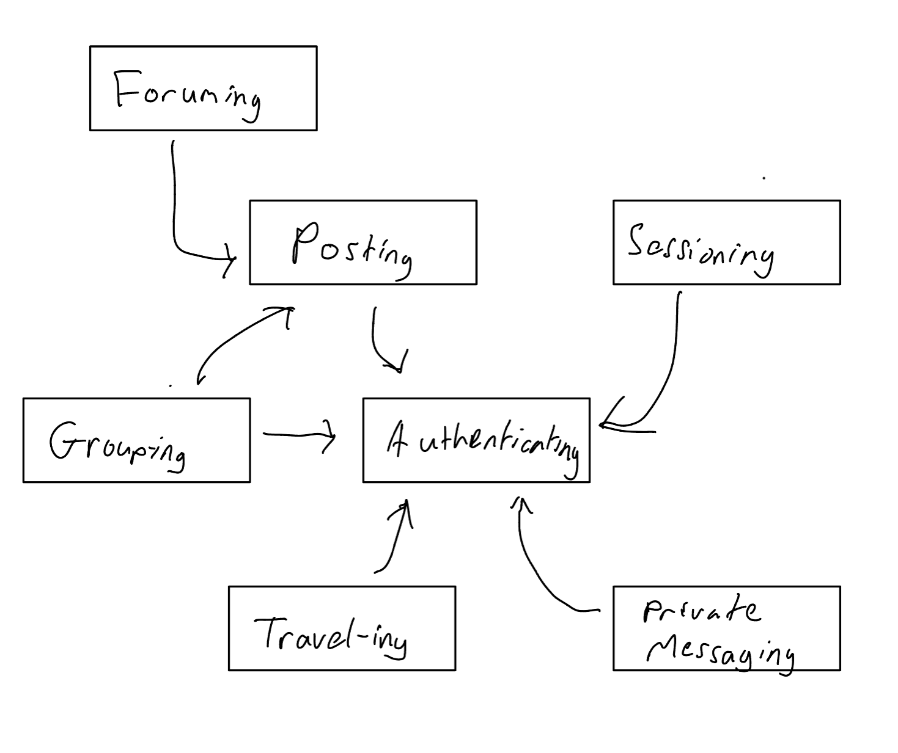

# Concept 1: Sessioning

**Purpose:** Sessioning tracks user sessions and promises secure interactions with the platform.

**Principle:** A user authenticated and is then funneled into a newly created session and is now able to repeatedly perform authenticated actions without the need to re-authenticate through getUser. The session can then be ended.

**State:**

- **active**: set Session
- **user**: active -> one User

**Actions:**

- **start**(user: User, **output**: sess: Session)
> starts a session and assigns user to it. returns said session.
- **getUser**(sess: Session, **output**: user: User)
> does a session lookup and finds the user associated with a session
- **end**(sess: Session)
> ends the session, deleting it from active. 

# Concept 2: Authenticating

**Purpose:** authenticate users so that users can be assigned to actual people

**Principle:** One a person has registered, a person can authenticate and is then able to perform actions that are associated with a user on the platform

**State:**

- **registered:** set User
- **username, password**: registered -> one String

**Actions:**

- **register**(name, pass: String, **output:** user: User)
> registers a user and allows them to authenticate with a username and password. 
- **authenticate**(name, pass: String, **output:** user: User)
> authenticates a person so that they can perform actions associated with their User

# Concept 3: Travel-ing

**Purpose:** change user's known location so that their feed can be crafted to their current or planned locations. 

**Principle:** a user "travels" to a location virtually. The platform then begins to suggest subforums and connections that are common for that location. They can also hide or share their location with other users depending on their preferences.

**State:**

- **users**: set User
- **locations**: users -> one location: String

**Actions:**

- **travel**(user: User, location: String)
> sets a user's location to a specific place.
- **hideLocation**(user: User)
> allows a user to hide their own location from other Users
- **shareLocation**(user:User, sharedWith: User)
> allows a user to share their location with a specific user.
- **createLocationFilter**(location: Location, radius: integer, forumTypes: set String)
> creates a passable filter based on what location is specified.

# Concept 4: Group-ing

**Purpose:** users group together for an interactive UI that allows them to plan trips together, discuss possible destinations in group messages, put out polls or questions for deciding hotels, restaurants, and activities, and coordinate their recommendations.

**Principle:** once a number of users have grouped together, an temporary additional tab is made available to the users in this "group". This tab uses a uniform format across all users, and allows activity between users in a separate space. 

**State:**

- **users**: set User
- **groups**: set Group
- **admin**: groups -> one User
- **members**: groups -> set User

**Actions:**

- **isGroupAdmin**(user: User, group: Group, **output**: boolean)
> returns True iff the user is the admin of the group. By default, that is the creator.
- **createGroup**(user: User, groupName: String, **output:** group: Group)
> a registered user requests to create a Group with name groupName, and the server creates it.
- **disbandGroup**(user: User, group: Group)
> a user requests for a group to be disbanded. If this user is admin, this group is then deleted from the server.
- **invite**(inviter: User, invitee: User, group: Group)
> if User inviter has permission to invite to group, an invite notification is sent to User invitee to join Group group.
- **joinGroup**(user: User, group: Group)
> User user puts in a request to join Group group. This request is sent to the admin, or granted immediately given a pending invite.
- **leaveGroup**(user: User, group: Group)
> user ceases to be associated with Group group.
- **getGroupBoard**(user: User, group: Group)
> returns a platform specific to the group if one exists and user is a part of group.
- **createGroupBoard**(group: Group, objectType: Class, out: object(Generic))
> creates a generic platform of type objectType for the group.
- **deleteGroupBoard**(group: Group, toDelete: object(Generic))
> deletes platform associated with the group if there is one.
- **getMembers**
> gets the members associated with a group.

# Concept 5: Forum-ing

**Purpose:** organize sections of the platform based on criteria, such as location, type of activity/location, etc. allow isolation of certain discussion topics and specific engagement on one topic.

**Principle:** a user subscribes to a forum based on topic and is then allowed to interact with and receive notifications relevant to activity on forum.  

**State:**

- **forums**: set Forum
- **followers**: forums -> set User
- **forumLocations**: forums -> one Location
- **userLocations**: location -> set User

**Actions:**

- **joinForum**(user: User, forum: Forum)
> user joins or puts in a request to join Forum forum. If granted, they will be added to the associated followers list for that forum.
- **leaveForum**(user: User, forum: Forum)
> user is removed from the follow list for Forum forum
- **sortForums**(user: User, filter: Filter)
> on user's page, forums are sorted according to Filter filter

# Concept 6: Posting

**Purpose:** allows users to create and publish text blocks. these posts are then made available to other users. Included in this concept is the sub-concept of replying.

**Principle:** a user posts a text block that is then published to the rest of the platform in a prompt manner, allowing interaction and posts (replies) responding to the original user's post. The user can also delete or edit the post

**State:**

- **users**: set User
- **author**: post: Post -> one User
- **replies**: post: Post -> set Post

**Actions:**

- **post**(user: User, s: String, **output:** p: Post)
> creates a post and publishes it to other users.
- **editPost**(user: User, post: Post, new: String, **output:** p: Post)
> edits an already created post. This action can only be performed by the author of the post.
- **deletePost**(user: User, post: Post)
> deletes a post that was created by user. This can only be performed by a post's author.
- **reply**(user: User, orig_post: Post, reply: String, **output:**: p: Post)
> creates a Post reply authored by User with its Parent being the post orig_post. Upon orig_post being deleted, this post will also be deleted.
- **isAuthor**(user: User, post: Post, **output:** boolean)
> returns True iff user is the creator of post
- **getParent**(post:Post, **ouput:** parent: Post)
> gets the parent post of a post, if there is any.
- **getReplies**(post:Post, **output:** replies: set(Post))
> gets the child posts of any post, if there are any.

# Concept 7: Private Messaging

**Purpose:** allows users to communicate privately with one another, enhancing the ability to connect on the platform.

**Principle:** a user sends a private message to another user, the other user receives the message and has the option to send a private message back.

**State:**

- **users**: set User
- **messages**: (usersInChat: set User) from users -> set messages: set(String)
- **chats**: users -> set(set User)
- **blocked** users -> set User

**Actions:**

- **message**(user: User, recipient: User, s: String, **output**: m: Message)
> sends a string to another User or set of Users.
- **block**(user: User, blocked: User)
> makes a user unable to message another user.
- **createGroupchat**(user: User, recipients: set(Users), **output**: Chat)
> creates a chat with more than one person. This is a separate function to allow for conflict resolution with blocking function.

# Possible Concept 8: Profile Customization

# Syncs:

- sync login(user, pass: String, out: User, out: session: Session)
> Authenticating.authenticate(user, pass)
> Sessioning.start(user)

- sync filterByLocation(sess: Session, loc: Location,radius, forumTypes)
> user = Sessioning.getUser(session)
> filter = Traveling.createLocationFilter
> Foruming.sortForums(user, filter)

- sync createGroupForum(sess: Session, groupID: String)
> user = Sessioning.getUser(session)
> if Grouping.isGroupAdmin(user) 
> then Grouping.createGroupBoard(groupID, Forum)

- sync deleteGroupForum(sess: Session, groupID: String)
> user = Sessioning.getUser(session)
> if Grouping.isGroupAdmin(user) 
> then Grouping.createGroupBoard(groupID, Forum)

-sync coordinateGroupFilter(sess: Session, groupID: String, filter: Filter)
> user = Sessioning.getUser(session)
> if Grouping.isGroupAdmin(user) 
> for user in Grouping.getMembers(groupID):
> > Foruming.sortForums(user, Filter)

# Dependency Diagram:

# Tradeoffs:

**Location Privacy?** The first large tradeoff I had to make in my design was one regarding privacy risks. By making a travel-based social media, I am inherently creating a close association between profiles and their known locations. I had to decide whether to increase the functionality of my site or keep the site more secure by not storing any location info. I decided on what I think is a good middle ground and allow users to decide their own location, and this location will not be available to anyone except for people you allow to see it.

**Moderation**: I had to decide to lessen proper moderation as a priority of mine when I shifted to more of a focus on travel. In order to allow people to more freely express their experiences, I can't allow as open of a community-led moderation attempt as I wanted in last assignment. 

**Profile Customization**: I had to reduce customizability as a priority. While my interviewees seemed excited about customizability options, it seemed more important to them to be able to connect with other people actively than to portray themselves passively, so I will be putting profile customization on the back burner for now. 
